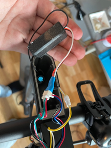

# [EN version of Handleiding inbouwen Xiaomi Motion Control](Handleiding&#32;inbouwen&#32;Xiaomi&#32;Motion&#32;Control.docx)
**DISCLAIMER** THIS DOCUMENT IS DIRECT TRANSLATION FROM ORIGINAL DOCUMENT FROM WHICH LICENCE DOES NOT BELONG TO ME! ALL RIGHT ARE RESERVED WITH THE OWNERS OF THE ORIGINAL DOCUMENT!

Before the Arduino is built in, software must be put on Arduino Nano. 
The software that is included is only to test the Arduino hardware-wise and does not offer support above 14 km/h.
To load the software, the Arduino IDE is needed.

This can be downloaded here: [Arduino IDE]

[Arduino driver CH340] (Only needed for  Windows):

Firmware can be found here, download the INO-file of the firmware:
* https://github.com/PsychoMnts/Xiaomi-Scooter-Motion-Control
* https://github.com/jelzo/Xiaomi-Scooter-Motion-Control
* https://github.com/kearfy/Xiaomi-Scooter-Motion-Control

*Some  variations require extra libraries, readthe github page. 

## [Installing Additional Arduino Libraries | Arduino]
1. Connect the Arduino Nano to the computer with a mini-USB cable
2. Open de Arduino INO file
3. Install the necessary libraries
   1. 
4. Search for arduino timer and install it with the Install button
   1. 
5. Set the correct board on ArduinoNano, and set the processor to ATmega328p (Old Bootloader)
   1. 
6. For Port, set the communication port of the arduino
7. Code upload
   1. 
8. If the upload is successful, build in the Arduino with the step-by-step plan below.

## Installation Steps:
1. Remove the plastic cover from the speedometer.   This is stuck but can usually be pulled loose with your nails.   __If it is very tight, you can use a hair dryer to soften the glue.__
   1. 
2. Unscrew the circuit board in the handlebars.
   1. 
3. Disconnect the connector.
   1. 
4. Cut the tie-wrap from the rubber cap (collor may differ)
   1. 
5. Disconnect all connectors.   __Be careful, these connectors are very sensitive.   When these are damaged, malfunctions can occur later__
   1. 
6. Remove the cap and the right side of the handlebars.
   1. 
7. Slide the rubber off the handlebars
   1. 
8. Loosen the throttle with an allen so that it can slide.
   1. 
9. Remove the rubber cover cap.
   1. 
10. Remove the cord from the throttle and slide the entire throttle off the scooter.   **This step can be tricky.   Make sure that the connector is properly oriented and then it can be carried exactly through the hole.**
    1. 
11. Unplug the handlebars with the allen key that comes with the scooter
    1. 
12. Pass the extension cable with branch through the handlebar
    1. 
13. Connect the extension cable and replace the steering wheel.   **Please note that you do not pierce cables with the repositioning of the screws!**
    1. 
14. Connect the  JST plug to the  gas cable.   **Note: AZdelivery Arduino Nano's have the JST plug soldered to the Nano.**
    1. 
15. Tie the cables back together with the supplied tie-wrap.
    1. 
16. Connect the dashboard and screw it in
    1. 
    2. 
17. Stick the plastic cover back on the scooter.
    1. 

[Arduino IDE]: https://www.arduino.cc/en/software
[Arduino driver CH340]: http://www.wch.cn/downloads/file/65.html
[Installing Additional Arduino Libraries | Arduino]: https://www.arduino.cc/en/Guide/Libraries